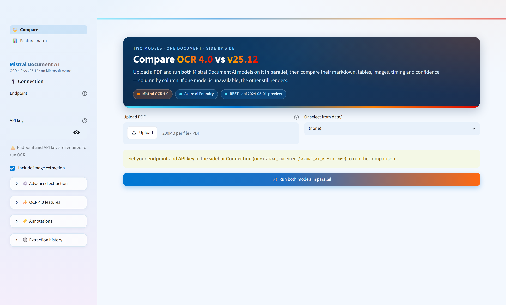
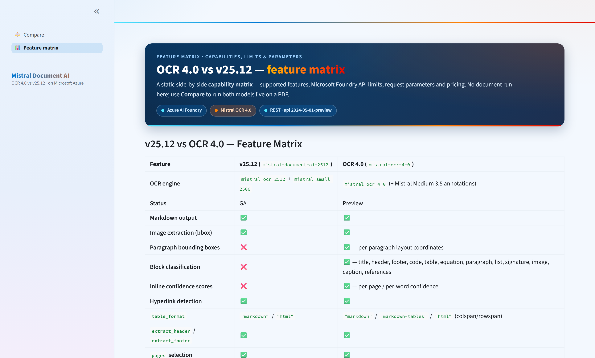

<div align="center">

# 📄 Mistral Document AI on Azure

### OCR 4.0 vs v25.12 — a side‑by‑side OCR demo on Microsoft Foundry

[](https://ai.azure.com/)
[](https://mistral.ai/news/ocr-4/)
[](https://streamlit.io/)
[](https://www.python.org/)
[](https://github.com/astral-sh/uv)

Extract **text, tables, images, layout blocks and confidence scores** from PDFs with two Mistral
Document AI models — and compare them on the **same document, in parallel**.



</div>

---

## ✨ What's inside

- 🔀 **Two models, one document, side by side** — run **OCR 4.0** and **v25.12** **in parallel** and diff their output column by column.
- 🎨 **Branded Streamlit app** — Azure × Mistral theme, native PDF viewer, no model selector (it always runs both).
- 🧱 **Latest OCR 4.0 features** — paragraph bounding boxes, block classification, inline confidence scores, 170 languages, streaming.
- ⚙️ **Reusable Python client** — async REST client (`src/extract.py`), CLI, and a Jupyter notebook.
- ☁️ **Microsoft Foundry native** — both models as **GlobalStandard** deployments on one endpoint, API‑key or Azure AD auth.

## 🤖 Models at a glance

| Model | Version | Deployment | Highlights |
|-------|---------|------------|-----------|
| 🔵 Mistral Document AI 2512 | `v25.12` · **GA** | `mistral-document-ai-2512` | OCR, images, bbox annotations, `table_format`, header/footer |
| 🟠 Mistral Document AI OCR 4.0 | `4.0` · **Preview** | `mistral-ocr-4-0` | **+** paragraph bboxes, block classification, inline confidence, 170 languages, streaming |

> 💡 OCR 4.0 requires a **GlobalStandard** (or DataZoneStandard) deployment and is currently in **Preview**.

## 🚀 Quick start

```bash
# 1. Deploy both models + write .env automatically
./scripts/deploy_all.sh --account-name "my-ai-foundry" --resource-group "rg-demo"
#  (PowerShell) .\scripts\deploy_all.ps1 -AccountName "my-ai-foundry" -ResourceGroup "rg-demo"

# 2. Install dependencies (uv)
uv venv --python 3.12
uv sync

# 3. Launch the app
uv run streamlit run app.py
```

<details>
<summary>🔧 Already deployed? Generate <code>.env</code> from an existing account</summary>

```bash
# Bash
./scripts/setup_env.sh --account-name "my-ai-foundry" --resource-group "rg-demo"
# PowerShell
.\scripts\setup_env.ps1 -AccountName "my-ai-foundry" -ResourceGroup "rg-demo"
```

This discovers the endpoint, deployment names and API key and writes `.env`. For Azure AD auth
(recommended for production) add `--auth aad` / `-AuthMode "aad"`. Or copy `cp .env.example .env`
and edit it manually.

</details>

<details>
<summary>📦 Other entry points — CLI, sample PDF, notebook</summary>

```bash
# Generate a complex sample PDF (tables + charts)
uv sync --extra scripts
uv run python scripts/generate_sample_pdf.py    # -> data/sample_complex_report.pdf

# Batch-extract every PDF in data/ (markdown + JSON + CSV into extraction/)
uv run extract

# Interactive notebook walkthrough
uv sync --extra notebook
uv run jupyter lab demo_ocr.ipynb
```

</details>

## 🖥️ The Streamlit app

> Requires **Streamlit ≥ 1.58** (latest GA, pinned in `pyproject.toml`). The whole UI is themed with
> the **Azure** (`#0078D4`) and **Mistral** (`#FF6A13`) palettes; the Deploy button and dev menu are hidden.

Built with **`st.navigation`** — two focused pages:

| Page | What it does |
|------|--------------|
| ⚖️ **Compare** *(default)* | Pick or upload a PDF → run **both** models **in parallel** → explore both results column by column. |
| 📊 **Feature matrix** | Static capability / limits / parameters / pricing matrix comparing the two models. |

**On the Compare page:**

- ⚡ **One click → both models, concurrently** (`ThreadPoolExecutor`) — you wait for the slower model, not the sum. If OCR 4.0 is briefly unavailable (Preview 503), the v25.12 side still renders.
- 📊 **Side‑by‑side summary** — per‑model metrics (pages, words, tables, images, blocks, latency) + a consolidated **diff table**.
- 🔎 **Per‑model deep dive** — a tab per model (🟠 OCR 4.0 / 🔵 v25.12): rendered markdown, table extraction + CSV, image grid, per‑page breakdown (incl. blocks + inline confidence), annotations, and raw JSON.
- 👀 **Native PDF viewer** — the selected document is shown inline via `st.pdf` *before* extraction, with page‑count / size badges and a `>30 pages → auto‑chunked` hint.
- 🔌 **Shared sidebar** — Connection (**endpoint + API key, both required**) and collapsible OCR options that persist across pages.

<div align="center">

</div>

## 🔬 OCR 4.0 vs v25.12

| | v25.12 | OCR 4.0 |
|---|:---:|:---:|
| Status | GA | Preview |
| Markdown · images · hyperlinks | ✅ | ✅ |
| Paragraph bounding boxes | ❌ | ✅ |
| Block classification | ❌ | ✅ |
| Inline confidence scores | ❌ | ✅ |
| Streaming API | ❌ | ✅ |
| Languages | 25+ | **170** |
| `table_format` | `markdown` / `html` | `markdown` / `markdown-tables` / `html` |

<details>
<summary>📋 Full feature matrix & Foundry API limits</summary>

| Feature | v25.12 (`mistral-document-ai-2512`) | OCR 4.0 (`mistral-ocr-4-0`) |
|---------|----------------------------|----------------------------|
| **OCR engine** | `mistral-ocr-2512` + `mistral-small-2506` | `mistral-ocr-4-0` (+ Mistral Medium 3.5 annotations) |
| **Status** | GA | Preview |
| **Markdown output** | ✅ | ✅ |
| **Image extraction (bbox)** | ✅ | ✅ |
| **Paragraph bounding boxes** | ❌ | ✅ — per-paragraph layout coordinates |
| **Block classification** | ❌ | ✅ — title, header, footer, code, table, equation, paragraph, list, signature, image, caption, references |
| **Inline confidence scores** | ❌ | ✅ — per-page / per-word confidence |
| **Hyperlink detection** | ✅ | ✅ |
| **`table_format`** | `null` / `"markdown"` / `"html"` | `null` / `"markdown"` / `"markdown-tables"` / `"html"` (colspan/rowspan) |
| **`extract_header` / `extract_footer`** | ✅ | ✅ |
| **`pages` selection** | ✅ | ✅ |
| **`image_limit`** | ✅ | ✅ |
| **BBox / Document annotations** | JSON Schema structured output | JSON Schema structured output |
| **Streaming API** | ❌ | ✅ — reduced time-to-first-token |
| **Multilingual accuracy** | 99%+ across 25+ languages | **170 languages** |
| **Supported formats** | PDF, PNG, JPEG, AVIF, PPTX, DOCX | PDF, PNG, JPEG, AVIF, PPTX, DOCX |
| **Deployment SKU** | GlobalStandard | GlobalStandard / DataZoneStandard |
| **Pricing (Global Standard)** | per Foundry pricing | $4 / 1K pages (OCR) · $5 / 1K pages (OCR + annotations) |

**API limits (Microsoft Foundry)**

| Limit | Value | Notes |
|-------|-------|-------|
| **Max file size** | **30 MB** per request | Both models |
| **Max pages per request** | **30 pages** | Documents > 30 pages are auto-chunked by this project |
| **Annotations page limit** | **8 pages** | `document_annotation` processes only the first 8 pages |
| **Supported formats** | PDF, PNG, JPEG, AVIF, PPTX, DOCX | Images count as 1 page |

</details>

## 🔐 Authentication

| Method | Setup |
|--------|-------|
| 🔑 **API key** | Set `AZURE_AI_KEY` in `.env` |
| 🛡️ **Azure AD** | `az login`, leave `AZURE_AI_KEY` empty (DefaultAzureCredential) |

> The **Streamlit Compare app requires an API key** (endpoint + key are both mandatory in the sidebar).
> Azure AD remains fully supported for the Python library / notebook (`ocr_pdf` with `AZURE_AI_KEY` empty).

## 🔌 API reference

<details>
<summary>REST endpoint, request body & OCR 4.0 example</summary>

```text
POST {endpoint}/providers/mistral/azure/ocr?api-version=2024-05-01-preview
```

```json
{
  "model": "mistral-document-ai-2512",
  "document": { "type": "document_url", "document_url": "data:application/pdf;base64,{base64_pdf}" },
  "include_image_base64": true,
  "table_format": "markdown",
  "extract_header": true,
  "extract_footer": true,
  "bbox_annotation_format": { "type": "json_schema", "json_schema": { "name": "ImageDescription", "schema": {}, "strict": true } },
  "document_annotation_format": { "type": "json_schema", "json_schema": { "name": "DocumentSummary", "schema": {}, "strict": true } },
  "document_annotation_prompt": "Summarize this document."
}
```

The response contains `pages[]` with `markdown`, `images[]`, `tables[]`, `hyperlinks[]`, `header`,
`footer`, `dimensions`, plus top-level `document_annotation`. **OCR 4.0** additionally returns
`pages[].blocks` (when `include_blocks` is set) and `pages[].confidence_scores` (when
`confidence_scores_granularity` is set):

```json
{
  "model": "mistral-ocr-4-0",
  "document": { "type": "document_url", "document_url": "data:application/pdf;base64,{base64_pdf}" },
  "include_blocks": true,
  "confidence_scores_granularity": "page"
}
```

</details>

<details>
<summary>⚙️ Request parameters (v25.12 / OCR 4.0)</summary>

| Parameter | Type | Default | Description |
|-----------|------|---------|-------------|
| `table_format` | `"markdown"` \| `"html"` \| `null` | `null` | Structured table output (also added to `pages[].tables[]`) |
| `extract_header` | `bool` | `false` | Extract page headers into `pages[].header` |
| `extract_footer` | `bool` | `false` | Extract page footers into `pages[].footer` |
| `pages` | `list[int]` | all | Select specific pages (0-indexed) |
| `image_limit` | `int` | unlimited | Max images returned across the document |
| `include_blocks` | `bool` | `false` | **OCR 4.0** — content blocks with bbox + type into `pages[].blocks` (layout-aware pipelines, RAG chunking, citations) |
| `confidence_scores_granularity` | `"page"` \| `"word"` \| `null` | `null` | **OCR 4.0** — inline confidence into `pages[].confidence_scores` (human-in-the-loop QA, error flagging) |

</details>

<details>
<summary>🏷️ Annotations (structured extraction via JSON Schema)</summary>

Annotations extract structured data from images (bbox) or the whole document. **Limited to the first 8 pages.**

- **BBox annotations** (`bbox_annotation_format`) — applied to **each image**: classify/describe charts, photos, logos, tables… returned alongside the image base64.
- **Document annotations** (`document_annotation_format` + `document_annotation_prompt`) — applied to the **whole document**: one structured JSON object (classification, entity extraction, invoice parsing, compliance tagging).

```json
{
  "document_annotation_format": {
    "type": "json_schema",
    "json_schema": {
      "name": "DocumentSummary",
      "schema": {
        "type": "object",
        "properties": {
          "topics":   { "type": "array", "items": { "type": "string" } },
          "entities": { "type": "array", "items": { "type": "string" } },
          "summary":  { "type": "string" }
        },
        "required": ["topics", "entities", "summary"],
        "additionalProperties": false
      },
      "strict": true
    }
  },
  "document_annotation_prompt": "Summarize this document with key topics and entities."
}
```

The result is returned in the top-level `document_annotation` field. **Uses**: document classification,
invoice field extraction, contract clause detection, chart-to-table conversion, compliance tagging.

</details>

## 📁 Project structure

```text
mistral-document-ai/
├─ app.py                 # Streamlit multipage UI: Compare (parallel two-model) / Feature matrix
├─ src/extract.py         # Core OCR client (async, REST, multi-model)
├─ demo_ocr.ipynb         # Jupyter notebook walkthrough
├─ scripts/               # deploy_all · setup_env · generate_sample_pdf
├─ .streamlit/config.toml # Azure × Mistral whole-UI theme
├─ docs/                  # README screenshots
├─ data/                  # your PDFs
└─ extraction/            # OCR output (markdown, CSV, JSON)
```

## 📚 Resources

- 📘 [Document AI — Overview](https://docs.mistral.ai/capabilities/document_ai) · [OCR Processor](https://docs.mistral.ai/capabilities/document_ai/basic_ocr) · [Annotations](https://docs.mistral.ai/capabilities/document_ai/annotations) · [Document Q&A](https://docs.mistral.ai/capabilities/document_ai/document_qna) · [OCR API Reference](https://docs.mistral.ai/api/endpoint/ocr)
- ☁️ [OCR 4.0 — Azure Model Card](https://ai.azure.com/catalog/models/mistral-ocr-4-0) · [v25.12 — Azure Model Card](https://ai.azure.com/explore/models/mistral-document-ai-2512/version/1/registry/azureml-mistral)
- 📣 [OCR 4 & Mistral Medium 3.5 arrive in Microsoft Foundry](https://techcommunity.microsoft.com/blog/azure-ai-foundry-blog/mistral-document-ai-with-ocr-4-and-mistral-medium-3-5-arrive-in-microsoft-foundr/4529863) · [Mistral OCR 4 announcement](https://mistral.ai/news/ocr-4/)
- 🧑‍🍳 Cookbooks: [Structured outputs](https://colab.research.google.com/github/mistralai/cookbook/blob/main/mistral/ocr/data_extraction.ipynb) · [Tool use](https://colab.research.google.com/github/mistralai/cookbook/blob/main/mistral/ocr/tool_usage.ipynb) · [Batch OCR](https://colab.research.google.com/github/mistralai/cookbook/blob/main/mistral/ocr/batch_ocr.ipynb)

## ✅ Requirements

- Python **3.12+**, **Streamlit ≥ 1.58**, `numpy ≥ 2`, `pandas ≥ 2.2.2,<3`
- **Microsoft Azure** subscription with a [Microsoft Foundry](https://learn.microsoft.com/azure/ai-services/) account
- Mistral Document AI models deployed via `scripts/deploy_all.*`
- `az` CLI logged in (`az login`) · `uv` package manager (or `pip install -e .`)

> 📦 **Large PDFs (> 30 pages)** are automatically split into chunks and processed in sequence — results are merged transparently.
